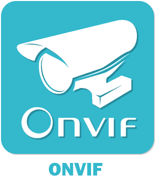

    

### Master:   

### Develop:   

# Présentation:

Template de permettant de céér des plugins pour Jeedom

# Documentation du plugin, comment créér un plugin:

*Effacer cette section dans votre plugin*

[Documentation principale](https://github.com/rjullien/plugin-ONVIF/blob/develop/docs/fr_FR/index-ONVIF.md)

[Comment documenter un plug-in](https://github.com/NextDom/NextDom/wiki/Documentation-d'un-Plugin)

[Comment tester un plugin](https://github.com/NextDom/NextDom/wiki/Tester-un-plugin-avec-travis-ci)

[Comment creer l'icône](https://github.com/NextDom/NextDom/wiki/07-Cr%C3%A9ation-d'une-icone-plugin)

[Les bonnes pratiques](https://github.com/NextDom/NextDom/wiki/Bonnes-pratiques-pour-les-plugins)

[Créér un plugun au standard NextDom](https://github.com/NextDom/NextDom/wiki/PROJET-:-Crit%C3%A8re-de-validation-d'un-plugin)

# Documentation du plugin:

[présentation](docs/fr_FR/presentation.md) [configuration](docs/fr_FR/configuration.md) [faq](docs/fr_FR/faq.md) [changelog](docs/fr_FR/changelog.md)

# Documentation complète:

